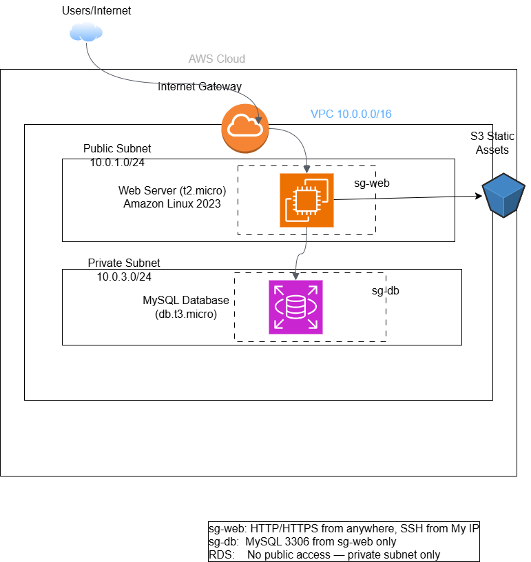

# AWS Two-Tier Infrastructure as Code (CloudFormation)

## Project Overview
Rebuilt the two-tier web infrastructure from Project 1 entirely as code using 
AWS CloudFormation — eliminating manual console provisioning and replacing it 
with a single reusable YAML template that deploys and tears down the entire 
stack in minutes.

This project demonstrates Infrastructure as Code (IaC) principles: 
repeatability, consistency, and automation of cloud resource provisioning.

---

## Architecture Diagram


---

## What Changed From Project 1
| Project 1 | Project 2 |
|-----------|-----------|
| Built manually via AWS Console | Deployed via CloudFormation YAML template |
| ~45 minutes to provision | ~3 minutes to provision |
| Hard to replicate consistently | Identical environment every deployment |
| Resources deleted one by one | Entire stack deleted with one command |
| No version control of infrastructure | Template committed to GitHub |

---

## Infrastructure Components

### CloudFormation Stack
Single YAML template defining all resources with explicit dependencies. 
CloudFormation resolves creation order automatically — VPC before subnets, 
Internet Gateway before routes, security groups before EC2.

### Parameters
Template accepts two runtime parameters:
- `KeyPairName` — EC2 key pair for SSH access (reusable across deployments)
- `YourIPAddress` — restricts SSH to a single IP in x.x.x.x/32 format

### Resources Deployed
- **VPC** (10.0.0.0/16) with DNS hostnames enabled
- **Public Subnet** (10.0.1.0/24) — auto-assigns public IPs on launch
- **Private Subnet** (10.0.3.0/24) — no internet route
- **Internet Gateway** — attached to VPC via explicit dependency
- **Public Route Table** — 0.0.0.0/0 → IGW, associated with public subnet
- **Security Group: sg-web** — HTTP/HTTPS from anywhere, SSH from specified IP only
- **Security Group: sg-db** — MySQL 3306 from sg-web only
- **EC2 t2.micro** — Amazon Linux 2023, Apache auto-installed via User Data
- **S3 Bucket** — static assets, all public access blocked

### Outputs
Stack exposes three outputs after deployment:
- Web Server Public IP
- Web Server URL (clickable)
- S3 Bucket Name

---

## Deployment Methods

### Method 1 — AWS Console
1. CloudFormation → Create Stack → With new resources
2. Upload `infrastructure.yaml`
3. Enter stack name: `two-tier-cfn-stack`
4. Parameters: enter key pair name and your IP (x.x.x.x/32)
5. Click through → Create Stack
6. Monitor Events tab until CREATE_COMPLETE
7. Check Outputs tab for web server URL

### Method 2 — AWS CloudShell (CLI)

**Upload template via CloudShell Actions → Upload file, then:**
```bash
# Deploy the stack
aws cloudformation create-stack \
  --stack-name two-tier-cfn-stack \
  --template-body file://infrastructure.yaml \
  --parameters ParameterKey=KeyPairName,ParameterValue=your-key-name \
               ParameterKey=YourIPAddress,ParameterValue=x.x.x.x/32 \
  --region us-east-1

# Check deployment status
aws cloudformation describe-stacks \
  --stack-name two-tier-cfn-stack \
  --region us-east-1 \
  --query 'Stacks[0].StackStatus'

# View outputs
aws cloudformation describe-stacks \
  --stack-name two-tier-cfn-stack \
  --region us-east-1 \
  --query 'Stacks[0].Outputs'
```

### Tear Down (Critical — avoid unexpected charges)

**Console:** CloudFormation → Select stack → Delete stack

**CLI:**
```bash
aws cloudformation delete-stack \
  --stack-name two-tier-cfn-stack \
  --region us-east-1
```

All resources delete automatically in the correct dependency order.

---

## Key Learnings

### CloudFormation intrinsic functions used
- `!Ref` — references another resource or parameter by logical name
- `!Sub` — substitutes variables into strings (e.g. stack name, region, account ID)
- `!GetAtt` — retrieves an attribute from a resource (e.g. EC2 public IP)
- `!Select` / `!GetAZs` — dynamically selects availability zone

### Dependency management
CloudFormation automatically handles creation order using implicit dependencies 
(`!Ref`, `!GetAtt`) and explicit dependencies (`DependsOn`). The `AttachGateway` 
resource uses `DependsOn` to ensure the Internet Gateway is attached to the VPC 
before the public route is created.

### ROLLBACK_COMPLETE — what it means
During development, a failed deployment triggers automatic rollback — 
CloudFormation deletes all created resources and returns the account to its 
previous state. Common causes: invalid parameter values, IAM permission issues, 
or resource naming conflicts. Delete the failed stack before redeploying.

### Key pair reusability
A single EC2 key pair can be reused across all deployments and all projects. 
The `.pem` file only needs to be downloaded once and stored securely — 
losing it means losing SSH access to any instance using that key pair.

---

## Cost
This project runs at **$0** on AWS Free Tier:
- EC2 t2.micro: 750 hours/month free
- S3: 5GB free
- VPC, CloudFormation, Security Groups: no charge
- **Always delete the stack when not in use**

---

## Repository Structure
aws-cloudformation-two-tier-infra/
├── infrastructure.yaml       # CloudFormation template
├── architecture-diagram.png  # Architecture diagram
└── README.md                 # This file
---

## Technologies Used
- AWS CloudFormation
- Amazon VPC
- Amazon EC2 (Amazon Linux 2023)
- Amazon S3
- AWS Security Groups
- AWS CLI
- Apache HTTP Server
- YAML

---

## Related Projects
- [Project 1 — Manual Two-Tier Web Infrastructure]
(https://github.com/okeoghene-dev/aws-two-tier-web-infrastructure)

---

## Author
**Okeoghene Esosuakpo**  
Solutions Architect | okeoghene-dev.github.io  
github.com/okeoghene-dev
